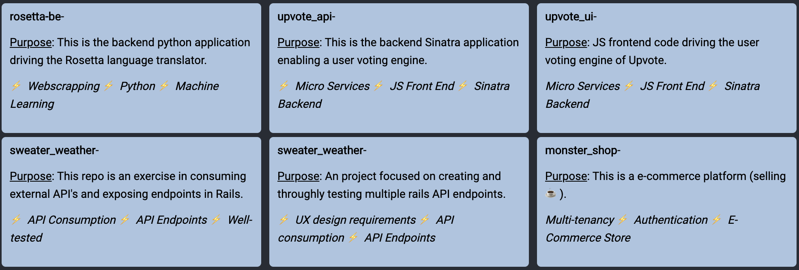

  <h2>Hello!!! 👋👋👋</h2>

📫 How to reach me: ...

  <ul>
    <li>Website: <a href="http://www.joshcodes.dev">
       joshcodes.dev</a>
      </li>
    <li>LinkedIn: <a href="https://www.linkedin.com/in/jtobannon/">
       jtobannon</a>
    </li>
    <li>Twitter: <a href="https://twitter.com/jtobannon">jtobannon</a></li>
  </ul>

👇 Pinned Repo Walkthrough 👇

  

<!--
**jobannon/jobannon** is a ✨ _special_ ✨ repository because its `README.md` (this file) appears on your GitHub profile.

| Repository | Purpose | Repository                     | Purpose |
|------------|---------|--------------------------------|---------|
| rosetta-be |         | sweater_weather                |         |
| upvote_api |         | rails_eng                      |         |
| upvote_ui  |         | monster_shop_individual_coupon |         |

Here are some ideas to get you started:

- 🔭 I’m currently working on ...
- 🌱 I’m currently learning ...
- 👯 I’m looking to collaborate on ...
- 🤔 I’m looking for help with ...
- 💬 Ask me about ...
- 📫 How to reach me: ...
-  Pronouns: ...
- ⚡ Fun fact: ...
-->
